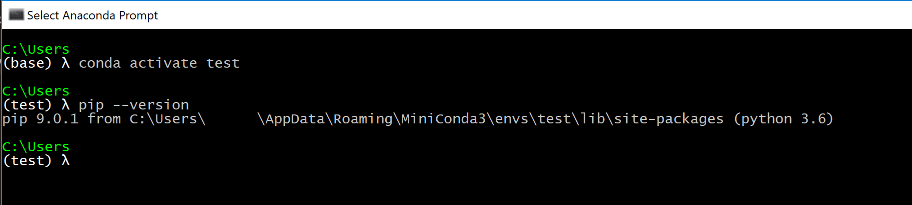

# Install Pytorch Windows

## Steps

1. Download Miniconda from https://repo.continuum.io/miniconda/Miniconda3-latest-Windows-x86_64.exe

    - Change Dest Folder to `C:\Users\YOUR_USERNAME\AppData\Roaming\MiniConda3\` (not req but better) 
      
    - For **advanced options**:
        - if you **do not** have any other python version installed on your system, **select both checkboxes**.
        - if you already have another python installed, **don't select any checkbox**. If you don't mind working with conda in future, it is best suggested you uninstall your normal python installation and and then install conda.
         
    - Install
2. Start Anaconda (this is the default way but you can make it easier later)
    - Goto Start
    - Search and run `Anaconda Prompt`
    - You should have a CMD window with "(base)" written in the prompt, *ignore the λ symbol, you will not see it!*
     
3. If step 2 is fine then installation went ok, now install [pytorch](https://github.com/peterjc123/pytorch-scripts)
    - Run `conda create -n test python=3.6 numpy pyyaml mkl` on **same prompt as step 2**
    - Above might take a while especially mkl, be patient
    - After all done, run `conda activate test`
    - Run `conda install -c peterjc123 pytorch`
4. Now test your installation
    - Make sure you are using same prompt as 3.
    - You should have a CMD window with "(test)" written in the prompt, if not run `conda activate test`.
    - Run `pip --version` and make sure it shows "Miniconda3" somewhere in the dir path.
     
    - Now run `pip install matplotlib pandas` and other stuff
    - Download the scripts from [in-too-deep](https://github.com/ML-Society/In-Too-Deep-Learning) repo either using git or zip
    - Run python `Week 0 - Intro to PyTorch and Linear Regression.py`
    - Profit! ... but seriously if you have a GPU use Linux!
