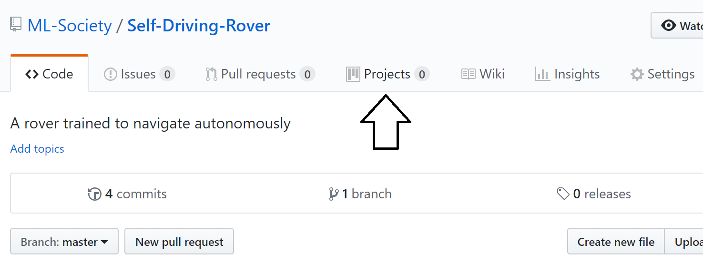
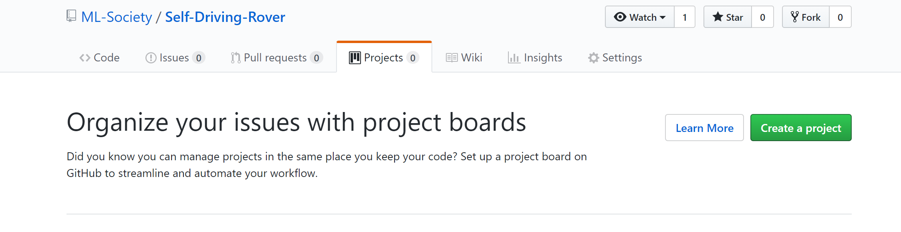
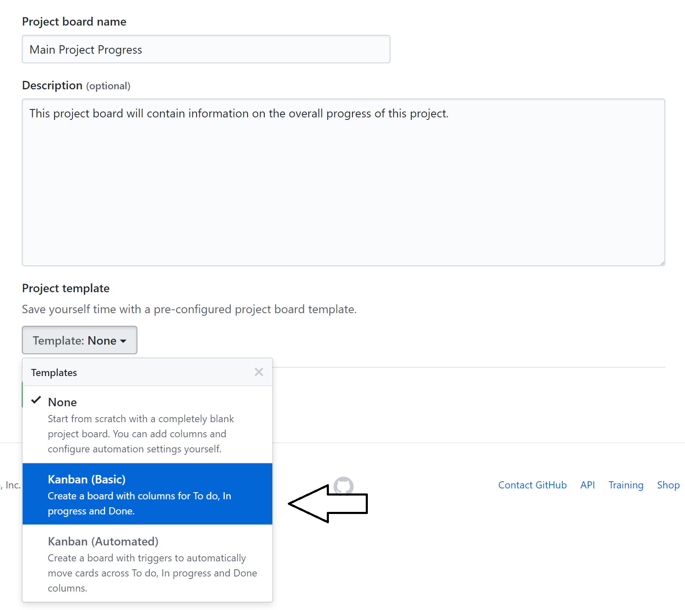
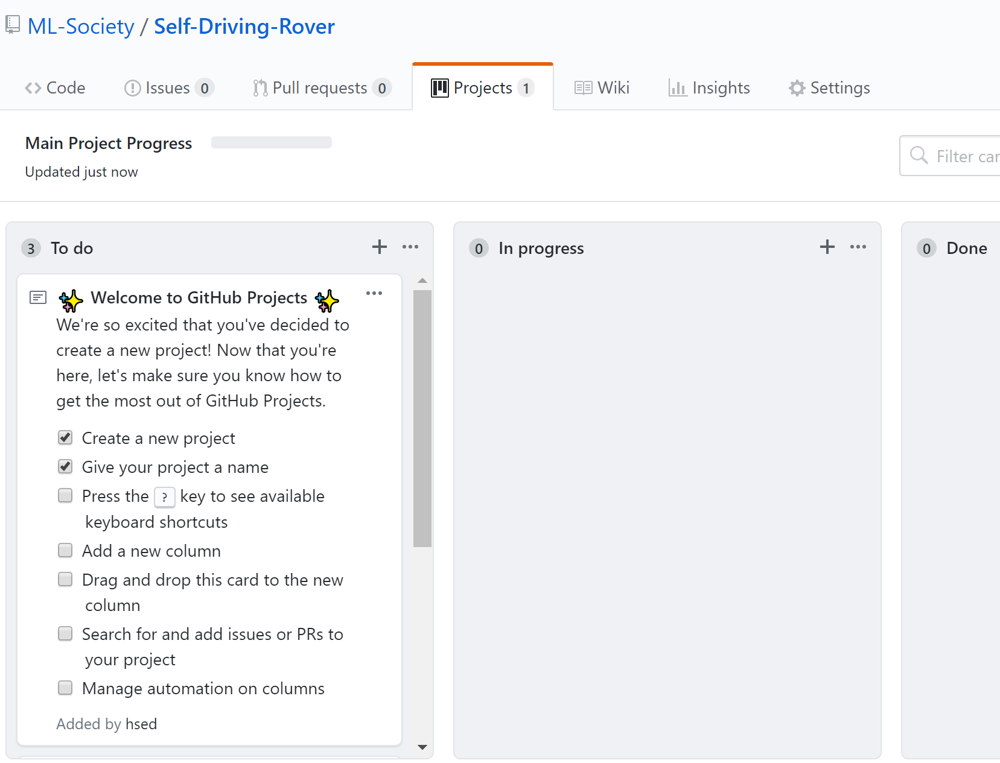
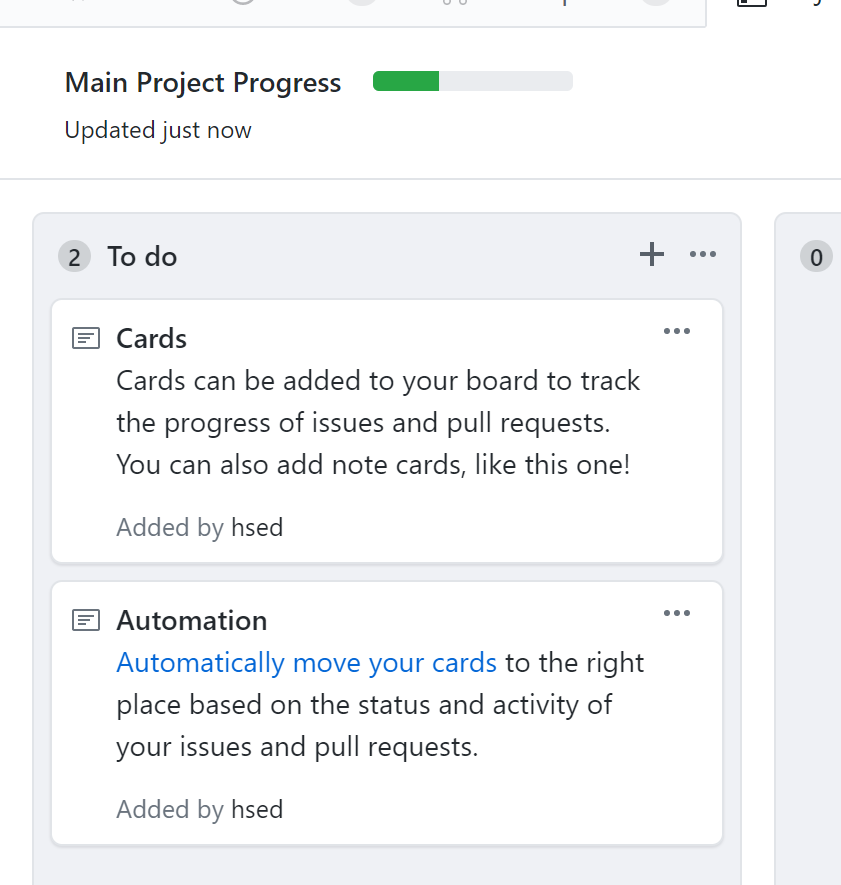
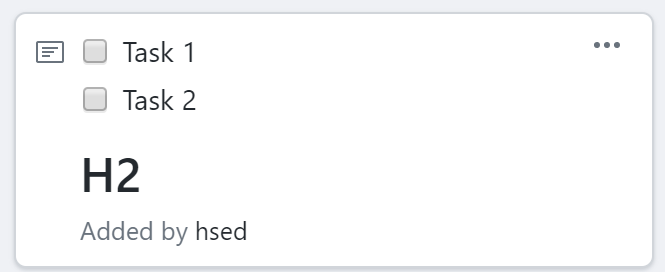
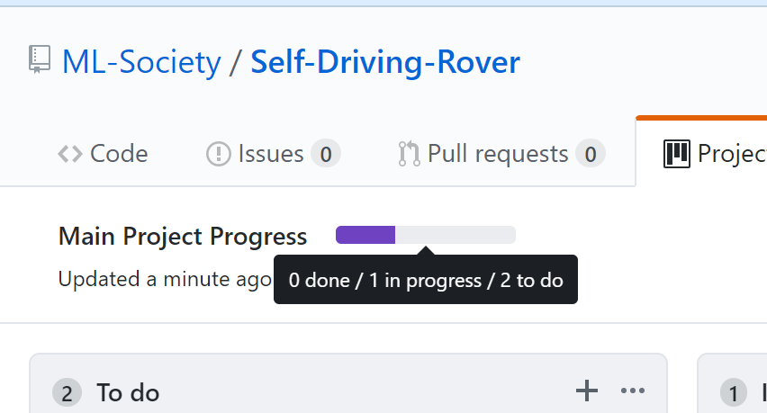

# Quick Intro to Github Projects

## Accessing the projects section

1. The projects section can be accessed by first selecting your repo and then choosing the **Projects** header. Make sure you are inside a github repo before creating a project.
  

## Creating a new project

This section is meant for project managers, if you are a team member you can skip this section.

1. Click **Create Project** to add a new project progress board.
  
1. Enter the details of the project board and choose the **Kanban (Basic)** template for auto-creation of columns.
  
1. Click **Create Project** and then your window should look something like the image below.
  
1. Have a read of the current template cards on GitHub for a brief overview
  

## Editing cards

This section is meant for anyone getting started with GitHub projects.

- To add a new card simply click the `+` button. Click the add button when done.
  

- You can use your normal markdown styles in GitHub cards, to add lists with checkbox placeholders use `[ ]` as shown below.
  

- It is a good idea to not clutter the board with many cards, if what you want to add is relevant to an existing card, simply use the elipses menu (`...`) on the card to edit it.

- A card can be moved to different columns depending on its status by simple drag-and-drop!

- The project's progress breakdown is available in the top-left corner
  